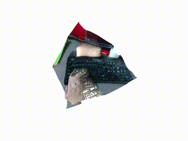

# remimi
This repository contains examples of some computer vision ML profgrams.

Feel free to post issue and PR when you find problem or new feature.

## Installation
Everything is tested on Ubuntu 20.04.
Most of the script requires GPU.

Please install pytorch, opencv (>4).

### Conda Environment
I recommend using environment management tool.
This is the example of using [conda](https://docs.conda.io/en/latest/miniconda.html).
```
conda create -n py38_remimi python=3.8.5
conda activate py38_remimi
```

### Dependencies
For cuda10
```bash
pip install torch torchvision torchaudio
pip install opencv-python
pip install mmcv-full -f https://download.openmmlab.com/mmcv/dist/cu102/torch1.8.0/index.html
```

For Cuda11.
```bash
pip install torch==1.8.1+cu111 torchvision==0.9.1+cu111 torchaudio==0.8.1 -f https://download.pytorch.org/whl/torch_stable.html
pip install opencv-python
pip install mmcv-full -f https://download.openmmlab.com/mmcv/dist/cu111/torch1.8.0/index.html
```

### Remimi Installation
```bash
git clone https://github.com/xiong-jie-y/remimi.git
pip install . -e
```

## Examples
### Human Elimination


This script will eliminate as many human as possible from the video.
To run this script,

```
python examples/remove_people.py --input-file ${INPUT_FILE_PATH} --output-file ${OUTPUT_FILE_PATH}
```

And please wait until finishes.

### Mask Creation


You can create dataset consists of mask of arbitracy class and frame by running the command.
You can find classes from [here](https://github.com/open-mmlab/mmsegmentation/blob/91159e2e5b9ac258440d714a40e0df6083aafee4/mmseg/datasets/ade.py#L15).

```
python examples/data_conversion/create_mask_image_dataset.py --input-file MOT17-02-FRCNN-raw.webm --output-folder test_imgs --class-names person
```

### Quilt video generator from a monocular video
This is the [quilt video](https://docs.lookingglassfactory.com/KeyConcepts/quilts/) generator from a monocular video.
Basically with the quilt video you can see holographic video with Looking Glass.
See the example of quilt video [here](https://docs.lookingglassfactory.com/KeyConcepts/how-it-works/).
So this script is for watching holographic version of any monocular video.
This script is not perfect, but you can enjoy some of the video.

#### Video Generation without inpainting of occluded part.
You can generate ordinary video without inpaint (occluded part will be dark).
You can just generate quilt video by using this command. 
`--cache-root` is the place where all the quilt image is output and maybe need more than 50GB space.
`--video-url` is the url of the video from which quilt video is generated.
You can add `--video-file` to indicate the location of the any video file instad of `--video-url`.

IT WILL TAKE MORE THAN 1 HOURS, and RTX 3070, 2070 or similar GPU's are recommended.

```bash
python examples/monodepth/create_point_cloud_video.py --video-url ${VIDEO_URL} --cache-root ${CACHE_ROOT} --output-path ${OUTPUT_PATH} --create-looking-glass

# Please output any video format you use to play quilt video.
# 
# I use hap encoding just because this is the only format that can be played
# smoothly in linux.
# For audio please take the auid from the original video, which is located under ${CACHE_ROOT}
ffmpeg -framerate ${FRAMERATE_OF_ORIGINAL_VIDEO} -i %06d_lkimage.png -c:v hap ${OUTPUT_PATH}.mov

# (optional) I usually convert audio seperately, because hap player doesn't support audio.
ffmpeg -i ${ORIGINAL_VIDEO} audio.mp3
```

#### Video Generation with inpainting of occluded part.
(TBD)

### 3D Video Viewer
You can watch the any videos in point cloud format. 
To create point cloud video, please use this command and wait for around 30 minutes for 4 minutes video. It requires few GB of space for caching.

```
python examples/monodepth/create_point_cloud_video.py --video-url ${VIDEO_URL} --cache-root ${SOMEWHERE_LARGE_SPACE} 
```

After creation, you can play video with

```
python examples/monodepth/play_point_cloud_video.py --video-url ${VIDEO_URL} --cache-root ${SOMEWHERE_LARGE_SPACE}
```

### Realtime Monocular Depth Estimation Examples with DPT(broken now)


This script will show point cloud from the camera stream.

* This scripts uses prime sense default camera intrinsic as default intrinsic. 
* When you use realsense you can use correct intrinsic easily, or for web cam please find intrinsic by yourself.
* The argument of the run_dpt_monodepth.py is almost same as DPT's run_monodepth.py script.

```bash
# (1) Install dependencies https://github.com/xiong-jie-y/DPT#setup

# (2) Download model from https://github.com/xiong-jie-y/DPT#setup

# (3) Run web camera depth stream.
# You can use realsense intrinsic parameters if you uses realsense and add --use-realsense flag.
python examples/monodepth/run_dpt_monodepth.py -m ~/gitrepos/DPT/weights/dpt_hybrid-midas-501f0c75.pt

# You can also show video file.
python examples/monodepth/run_dpt_monodepth.py -m ~/gitrepos/DPT/weights/dpt_hybrid-midas-501f0c75.pt --input-file $VIDEO_FILE
```

## LICENSE
This library and scripts are [MIT License](LICENSE). Some components has different license because they are inported from other repos for better integration. LICENSE files are in each directory.