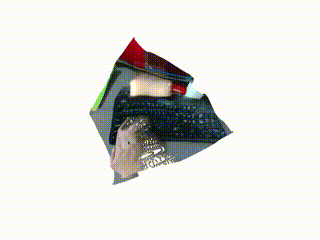

# Realtime Monocular Depth Estimation Examples
## DPT


```bash
# (1) Install dependencies https://github.com/xiong-jie-y/DPT#setup

# (2) Download model from https://github.com/xiong-jie-y/DPT#setup

# (3) Run web camera depth stream.
# You can use realsense intrinsic parameters if you uses realsense and add --use-realsense flag.
python examples/monodepth/run_dpt_monodepth.py -m ~/gitrepos/DPT/weights/dpt_hybrid-midas-501f0c75.pt
```